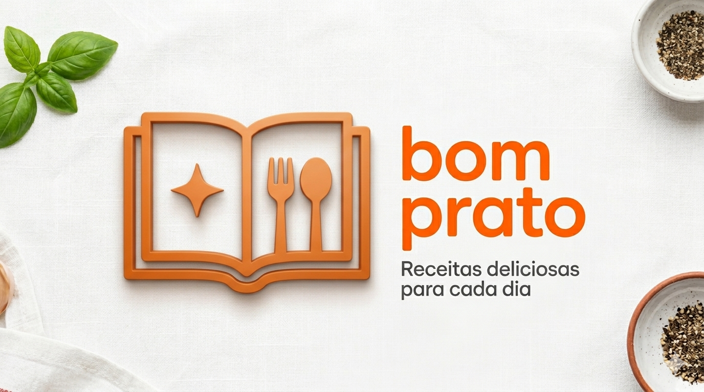

<figure>
  
  
Um aplicativo que fornece receitas de culinária com instruções detalhadas, planejamento de refeições e listas de compras.

</figure>

 

  |
  <a href="#tecnologias">Tecnologias</a> |
  <a href="#backlog">Backlog de User Stories</a> |
  <a href="#manual">Manual de Instalação</a> |

 

## 🛠️ Tecnologias

  
  &nbsp;&nbsp;&nbsp;&nbsp;
  
  &nbsp;&nbsp;&nbsp;&nbsp;
  
  &nbsp;&nbsp;&nbsp;&nbsp;
  

 

## 📋 Backlog de User Stories
| Rank | Prioridade | User Story | Estimativa | Sprint |
| ---- | ---------- | ---------- | ---------- | ------ |
| 1 | Alta | Como usuário, quero criar uma conta e perfil para salvar minhas informações e preferências. | 5 | 1 |
| 2 | Alta | Como usuário, quero configurar minhas alergias e restrições para que o app filtre automaticamente receitas perigosas. | 8 | 1 |
| 3 | Alta | Como usuário, quero filtrar receitas por categoria, nome, tempo de preparo ou dificuldade para encontrar o que cozinhar. | 5 | 1 |
| 4 | Alta | Como usuário, quero visualizar os detalhes da receita (ingredientes, preparo, tempo e porções) de forma organizada. | 5 | 1 |
| 5 | Alta | Como usuário, quero acessar minhas receitas favoritas e histórico mesmo sem internet. | 8 | 1 |
| 6 | Alta | Como usuário, quero seguir um preparo passo a passo guiado para manter o foco em cada etapa da receita. | 5 | 1 |
| 7 | Alta | Como usuário, quero acionar timers integrados aos passos da receita para não perder o tempo de cozimento. | 3 | 1 |
| 8 | Alta | Como usuário, quero ajustar o número de porções para que o app recalcule as quantidades de ingredientes automaticamente. | 5 | 1 |
| 9 | Alta | Como usuário, quero utilizar um conversor de medidas (xícaras, gramas, ml) para facilitar o preparo com diferentes utensílios. | 5 | 1 |
| 10 | Alta | Como usuário, quero favoritar receitas para criar minha coleção pessoal de pratos preferidos. | 3 | 1 |
| 11 | Alta | Como usuário, quero que o app registre as receitas que preparei com a data da conclusão para ter um diário culinário. | 3 | 1 |
| 12 | Alta | Como usuário, quero adicionar anotações pessoais às receitas preparadas para lembrar de ajustes futuros. | 2 | 1 |
| 13 | Alta | Como cozinheiro experiente, quero ativar o "Modo Chef" para ocultar as medidas e cozinhar de forma mais intuitiva. | 2 | 1 |
| 14 | Alta | Como iniciante, quero acessar um glossário de termos técnicos (ex: brunoise, selar) para aprender novas técnicas. | 3 | 1 |
| 15 | Alta | Como usuário, quero compartilhar o link ou imagem da receita via WhatsApp ou redes sociais para indicar aos amigos. | 2 | 1 |
16 | Alta | Como usuário, quero arrastar receitas para um calendário semanal para organizar meu plano alimentar. | 8 | 2
17 | Alta | Como usuário, quero que o app gere uma lista de compras consolidada somando ingredientes do meu plano semanal. | 8 | 2
18 | Média | Como usuário, quero editar manualmente minha lista de compras e marcar itens já comprados. | 5 | 2
19 | Média | Como usuário, quero exportar minha lista de compras em PDF ou texto para enviar a outra pessoa. | 3 | 2
20 | Média | Como usuário, quero receber notificações agendadas para iniciar o preparo das refeições do meu plano. | 5 | 2
21 | Média | Como usuário, quero inserir preços para que o app calcule o custo total da receita e o custo por porção. | 5 | 2
22 | Média | Como usuário, quero ver destaques de receitas sazonais baseadas na estação do ano atual. | 3 | 2
23 | Média | Como usuário, quero fazer backup e restauração dos meus dados para não perdê-los ao trocar de aparelho. | 8 | 2
24 | Média| Como usuário, quero cadastrar minhas próprias receitas completas para centralizar meu caderno de receitas no app. | 8 | 3
25 | Baixa | Como usuário, quero informar o que tenho na geladeira para que o app sugira receitas compatíveis. | 8 | 3
26 | Baixa | Como usuário, quero usar a câmera para registrar fotos dos meus pratos prontos e anexá-los ao meu histórico. | 5 | 3
27 | Baixa | Como usuário, quero usar comandos de voz para passar instruções do preparo guiado sem tocar na tela. | 8 | 3
28 | Baixa | Como usuário, quero adicionar itens à lista de compras usando comandos de voz por praticidade. | 5 | 3
29 | Baixa | Como usuário, quero avaliar com estrelas e deixar comentários nas receitas para registrar meu feedback. | 3 | 3
30 | Baixa | Como usuário, quero ver sugestões de substituição para ingredientes que não tenho em casa no momento. | 5 | 3

 

## ⚙️ Manual de Instalação

**1. Clone o repositório**
<pre>
git clone https://github.com/ErikaDias2/Bom-Prato.git
</pre>

 

**2. Instale as dependencias e rode o aplicativo**
<pre>
npm install
npx expo start
</pre>

 

**3. Baixe o aplicativo Expo Go no celular e escaneie o QR code que aparecerá no terminal após rodar o último comando**
